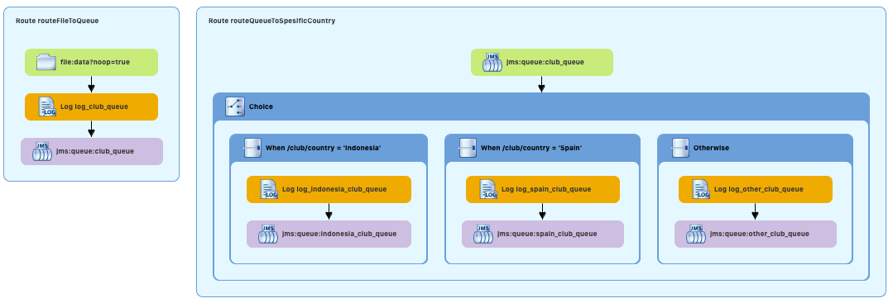

# Simple Project with Apache Camel and ActiveMQ

### Technology Used
1. Spring Boot 2 (Framework)
2. Apache Camel (Enterprise Integration Pattern)
3. ActiveMQ (Message Broker)

### How to run
1. Running ActiveMQ
    - If you haven't ActiveMQ 5, please download ActiveMQ Server in ```https://activemq.apache.org/components/classic/download/```
    - Running ActiveMQ with this command ```./bin/activemq start``` 
2. Running Application
    - Running application with this command ```mvn spring-boot:run```

    
### Diagram Flow

    
